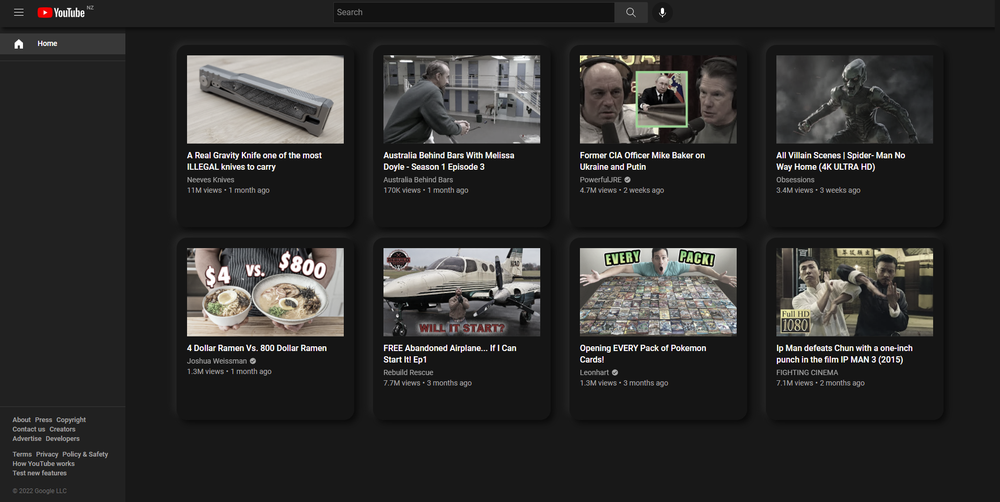
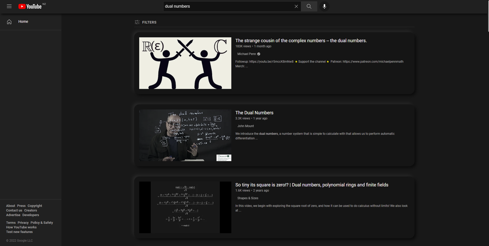
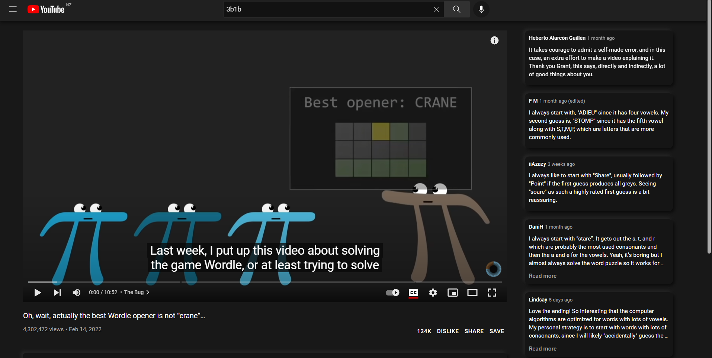
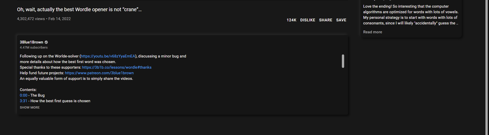
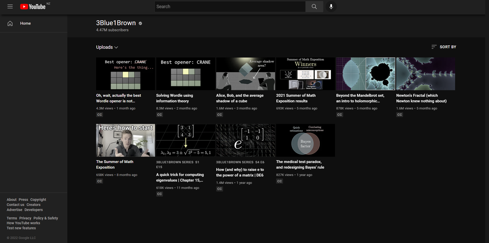

# Simplified.io 

The distraction free extension for YouTube.com

### Features
- Clean design
- Limited suggestion videos and comments
- Removal of distracting buttons
- Removed infinite scrolling
- Focus mode
- Very cool logo design

#### Home page

#### Search page

#### Video page

#### Channel page

### Installation
Goto [here](https://github.com/Troppydash/simplified-io/releases/latest/)

For chrome, download "simplified.io.zip", extract the zip file. Open chrome and goto "chrome://extensions", click "developer mode", click "load unpacked", select the folder with "manifest.json".

For firefox, download "simplifiedio-0.0.v-an+fx.xpi", drag the file into firefox and click "Add".

### License
Copyright 2022 Troppydash

Permission is hereby granted, free of charge, to any person obtaining a copy of this software and associated documentation files (the "Software"), to deal in the Software without restriction, including without limitation the rights to use, copy, modify, merge, publish, distribute, sublicense, and/or sell copies of the Software, and to permit persons to whom the Software is furnished to do so, subject to the following conditions:

The above copyright notice and this permission notice shall be included in all copies or substantial portions of the Software.

THE SOFTWARE IS PROVIDED "AS IS", WITHOUT WARRANTY OF ANY KIND, EXPRESS OR IMPLIED, INCLUDING BUT NOT LIMITED TO THE WARRANTIES OF MERCHANTABILITY, FITNESS FOR A PARTICULAR PURPOSE AND NONINFRINGEMENT. IN NO EVENT SHALL THE AUTHORS OR COPYRIGHT HOLDERS BE LIABLE FOR ANY CLAIM, DAMAGES OR OTHER LIABILITY, WHETHER IN AN ACTION OF CONTRACT, TORT OR OTHERWISE, ARISING FROM, OUT OF OR IN CONNECTION WITH THE SOFTWARE OR THE USE OR OTHER DEALINGS IN THE SOFTWARE.
